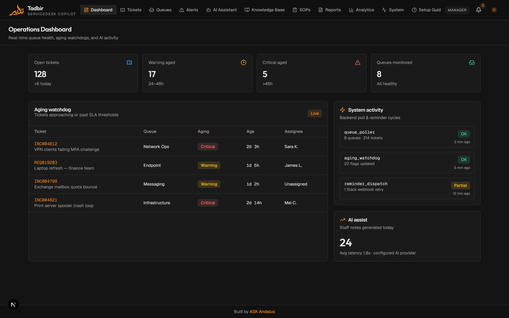
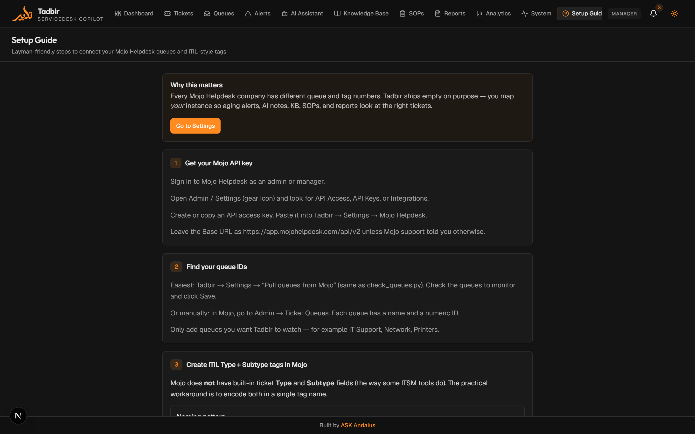
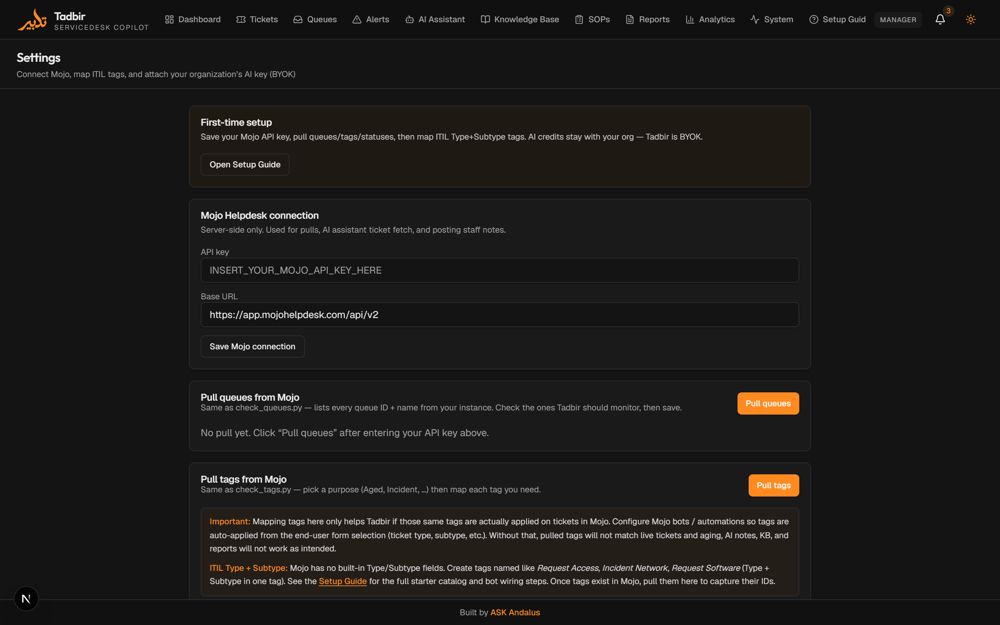
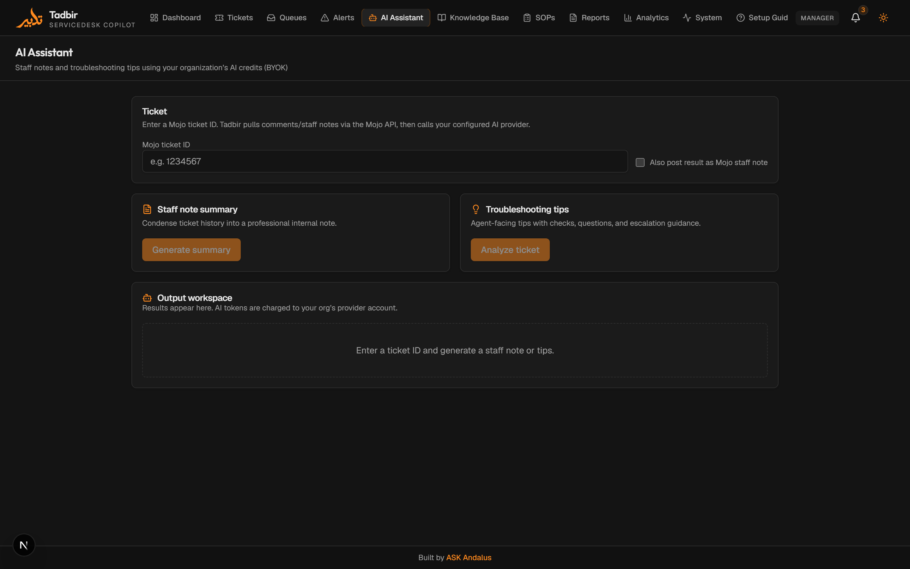
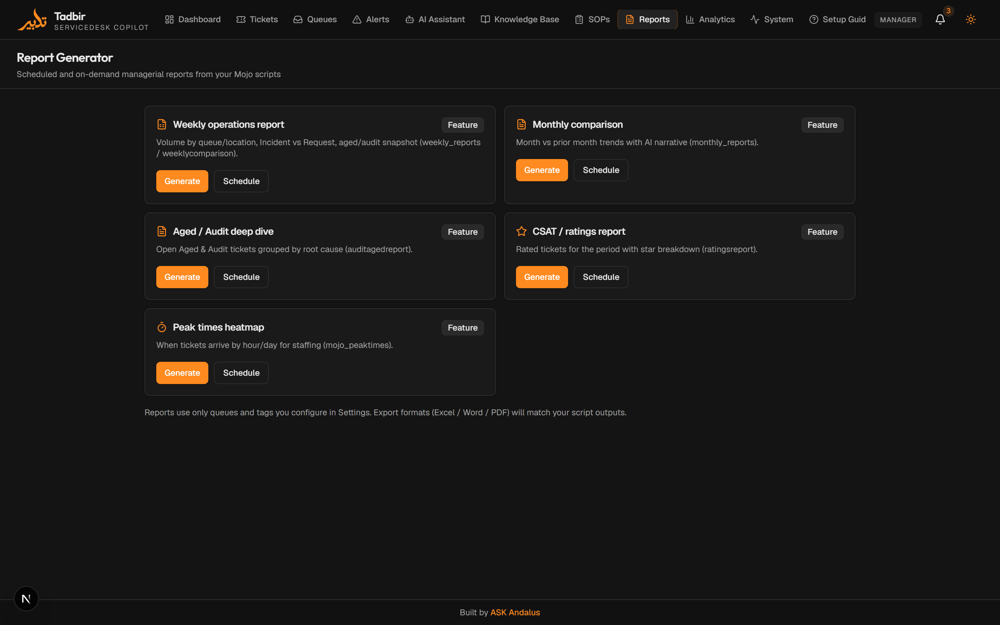
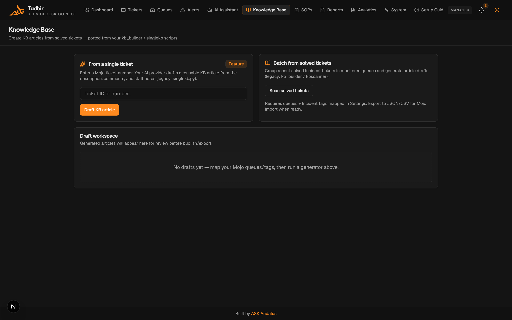
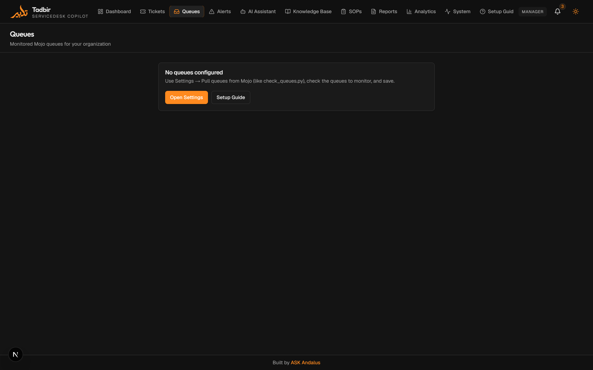
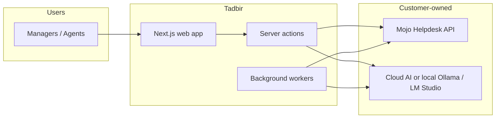

# Tadbir — ServiceDesk Copilot

  

  <strong>An operations layer for Mojo Helpdesk</strong> 
  Queue monitoring · Audit/Aged watchdogs · AI staff notes · KB / SOP / reports 
  <em>Bring your own AI key — or run models locally</em>

---

> **This repository is a public case study / portfolio showcase.**  
> It contains the product write-up and UI screenshots only — **not** the application source.  
> Private source is available to interviewers / serious collaborators on request.

**Built by [ASK Andalus](https://github.com/ahmadsk-cell)** · Not affiliated with Metadot or Mojo Helpdesk.
**LinkedIN:** [Ahmad Sheikh-Khalil](https://www.linkedin.com/in/ahmad-sheikh-khalil-161402149/)
---

## The problem

Many IT service desks run Mojo Helpdesk with a pile of one-off scripts (often in VS Code): auto-acks, aging tags, weekly Excel reports, KB drafts, staff-note helpers. Those scripts work — until keys live in files, every org’s queue/tag IDs are different, and nobody wants to maintain Python glue forever.

**Tadbir** replaces that workflow with a single web app managers and agents actually use.
> *Tadbir* (تدبير) means deliberate administration — the product thesis is that good operations are decided in advance, not improvised at the queue.

## What Tadbir does

| Area | Capability |
|------|------------|
| **Mojo connection** | Server-side API key, pull queues / tags / statuses, map *your* org’s IDs |
| **ITIL tags** | Mojo has no Type/Subtype fields — Tadbir guides `{Type} {Subtype}` tags + bot mapping |
| **Audit & Aged** | Configurable business-day thresholds; Mojo-bot recipes (staff notes, remove Audit when Aged) |
| **AI Assistant** | Pull ticket history → staff-note summary or troubleshooting tips → optional post to Mojo |
| **AI providers** | BYOK cloud (Anthropic, Gemini, NVIDIA, OpenAI) **or** local (Ollama, LM Studio) |
| **Knowledge / SOP / Reports** | Feature surfaces for KB articles, SOPs, and aged/audit-style reporting |

Tadbir sells **workflows + UI**, not AI tokens. Customers keep Mojo billing and AI spend.

---

## Screenshots

### Operations dashboard

### Setup guide (Mojo queues, ITIL tags, Audit/Aged bots)

### Settings — connect Mojo & map org data

### AI Assistant — BYOK staff notes & tips

### Report generator

### Knowledge base

### Queues

---

## Architecture (high level)

- **No VS Code required at runtime** — everything runs from the web app (and optional scheduled workers).
- Queue/tag IDs are **never hardcoded** — each org maps them in Settings.
- AI keys stay on the server (BYOK or local OpenAI-compatible endpoint).

---

## Stack

- **Frontend:** Next.js (App Router), TypeScript, Tailwind CSS, Framer Motion  
- **UI:** Dark charcoal theme, sunkist orange (`#FF8A1F`) accents  
- **Data:** PostgreSQL (Prisma), Redis (jobs/cache)  
- **ITSM:** Mojo Helpdesk REST API v2 (primary)  
- **AI:** Multi-provider client — cloud BYOK + local inference  

---

## Design decisions worth calling out

1. **Org-specific Mojo IDs** — discovery panels replace hardcoded queue/tag constants from legacy scripts.  
2. **ITIL via tags** — documented Type+Subtype naming + Mojo bot guidance because Mojo lacks native fields.  
3. **Audit vs Aged** — early warning vs escalated longevity (default 5 / 10 business days); Aged removes Audit; optional staff notes on apply.  
4. **BYOK + local AI** — cost control for write-ups/reports without Tadbir metering tokens.  
5. **Script parity path** — surfaces map to prior Mojo automation (staff notes, KB, SOP, weekly/aged reports).

---

## Status

Active product build. Core shell, Mojo discovery/settings, aging policy, multi-provider AI, and AI Assistant ticket flow are in place. Background pollers and full report/KB generation continue to land against the same architecture.

---

## Source & contact

| Want | How |
|------|-----|
| **Portfolio / interview walkthrough** | Ask for a private repo invite or a live demo |
| **Managed setup / Mojo bot configuration** | Reach out — setup help is often what teams actually need |
| **Issues with this write-up** | Open an issue on this repo |

**GitHub:** [ahmadsk-cell](https://github.com/ahmadsk-cell)
**LinkedIN:** [Ahmad Sheikh-Khalil](https://www.linkedin.com/in/ahmad-sheikh-khalil-161402149/)

---

## Disclaimer

Tadbir is an independent project. **Mojo Helpdesk®** is a product of Metadot Corporation. This project is **not** affiliated with, endorsed by, or sponsored by Metadot / Mojo Helpdesk. “Works with Mojo Helpdesk” describes API integration using credentials owned by each customer.
